# tokokita

A new Flutter project.

## Getting Started

This project is a starting point for a Flutter application.

A few resources to get you started if this is your first Flutter project:

- [Lab: Write your first Flutter app](https://docs.flutter.dev/get-started/codelab)
- [Cookbook: Useful Flutter samples](https://docs.flutter.dev/cookbook)

For help getting started with Flutter development, view the
[online documentation](https://docs.flutter.dev/), which offers tutorials,
samples, guidance on mobile development, and a full API reference.

## Screenshot
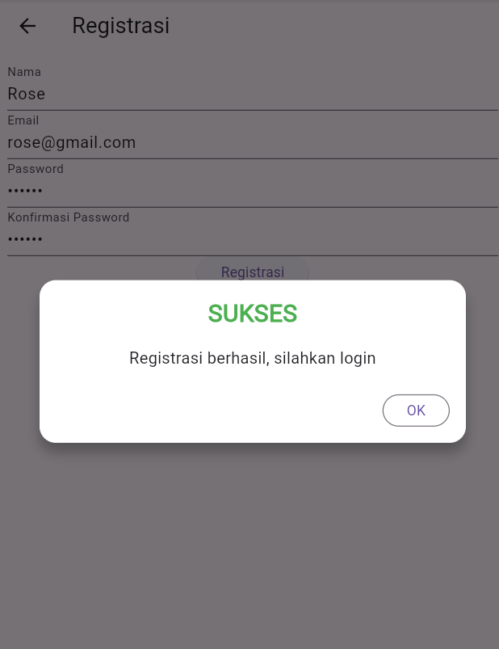
Proses registrasi dalam aplikasi ini dimulai ketika pengguna mengakses halaman registrasi. Di halaman ini, terdapat form yang meminta pengguna untuk mengisi beberapa informasi penting: nama, alamat email, dan kata sandi. Pengguna harus mengisi setiap kolom sesuai dengan petunjuk, di mana ada validasi yang memastikan nama yang dimasukkan minimal tiga karakter, email dalam format yang benar, dan kata sandi terdiri dari minimal enam karakter.

Setelah semua kolom diisi dengan benar, pengguna dapat menekan tombol "Registrasi." Di sini, aplikasi akan memeriksa apakah semua data yang dimasukkan valid. Jika ada kesalahan, pengguna akan diberikan umpan balik melalui pesan peringatan yang sesuai.

Setelah form divalidasi, data akan dikirim ke server menggunakan metode POST. Aplikasi akan melakukan panggilan API untuk mendaftarkan pengguna dengan mengirimkan nama, email, dan kata sandi. Selama proses ini, tampilan aplikasi akan menunjukkan status loading untuk memberi tahu pengguna bahwa permintaan sedang diproses.

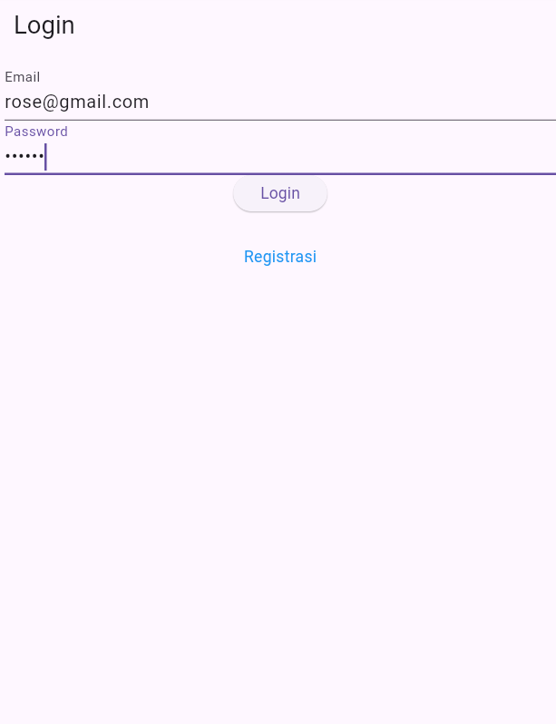
Kelas Login, yang berfungsi untuk menyimpan informasi pengguna yang diterima dari API setelah login berhasil, seperti kode respons, status, token, ID pengguna, dan email. Kelas ini memiliki metode fromJson untuk mengubah data dari format JSON menjadi objek yang bisa digunakan dalam aplikasi.

LoginBloc bertanggung jawab untuk mengirim permintaan login ke API menggunakan email dan password yang diinputkan pengguna. Jika API mengembalikan data yang valid, maka informasi tersebut akan dikemas dalam bentuk objek Login untuk kemudian disimpan di aplikasi. Informasi ini meliputi token pengguna yang akan digunakan sebagai bukti autentikasi.

Halaman LoginPage akan menjadi tampilan utama ketika pengguna membuka aplikasi. Halaman ini terdiri dari form untuk memasukkan email dan password, serta sebuah tombol login. Ketika tombol ditekan, aplikasi akan mengecek apakah data yang dimasukkan valid. Jika validasi berhasil, fungsi _submit() akan dijalankan untuk mengirim data ke LoginBloc. Jika login berhasil, aplikasi akan menyimpan informasi pengguna dan mengarahkan pengguna ke halaman utama (ProdukPage). Jika login gagal, aplikasi akan menampilkan pesan kesalahan untuk memberi tahu pengguna. Tersedia juga menu registrasi yang bisa diakses jika pengguna belum memiliki akun.

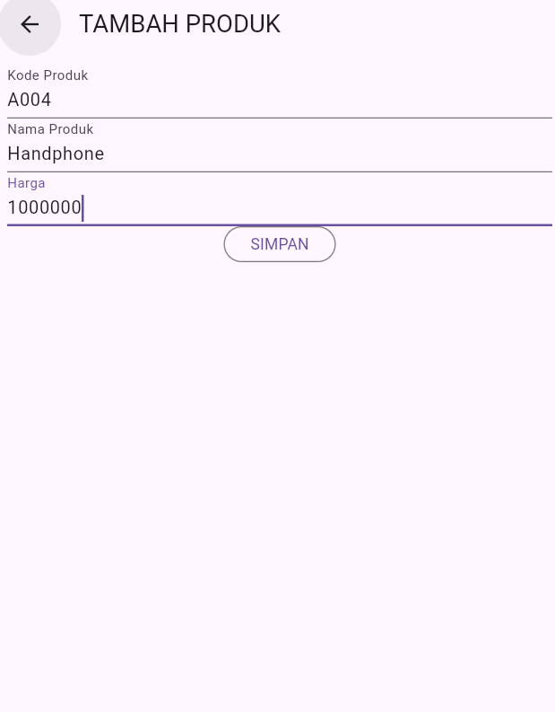
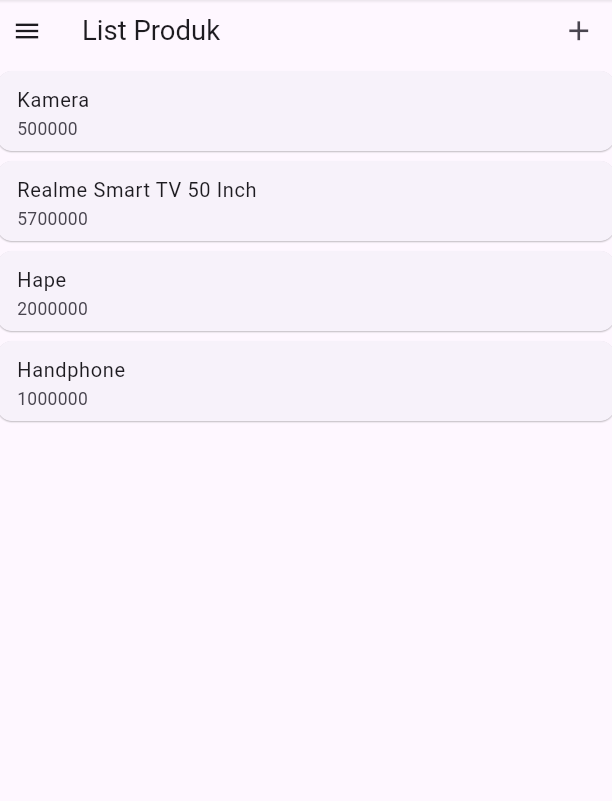
Proses tambah produk dimulai ketika pengguna mengisi form pada halaman ProdukForm dan menekan tombol "Simpan". Aplikasi akan mengambil data yang diinputkan dari masing-masing textbox, seperti kode produk, nama produk, dan harga produk, kemudian membentuk sebuah objek Produk baru. Data produk yang sudah siap tersebut dikirim ke fungsi addProduk dalam ProdukBloc. Di dalam fungsi ini, aplikasi membuat sebuah request POST ke API yang berfungsi untuk menambahkan produk baru ke dalam database. Jika proses berhasil, pengguna akan diarahkan kembali ke halaman ProdukPage yang menampilkan daftar produk terbaru. 

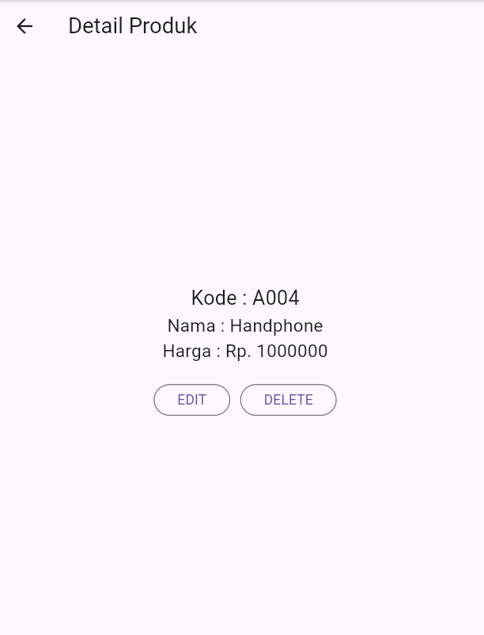
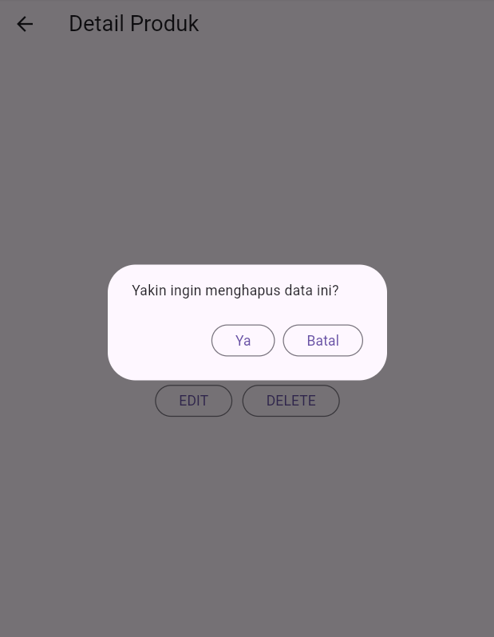
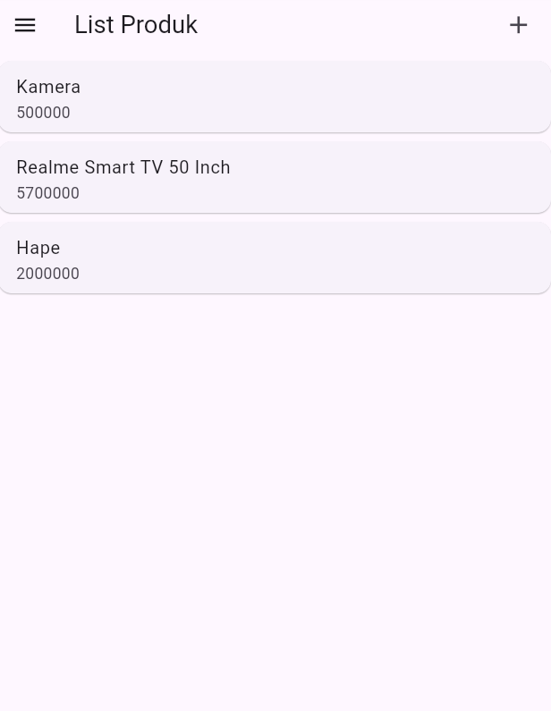
Proses hapus produk terjadi saat pengguna berada di halaman detail produk (ProdukDetail) dan menekan tombol "Delete". Sebuah dialog konfirmasi akan muncul untuk memastikan apakah pengguna benar-benar ingin menghapus produk tersebut. Jika pengguna memilih "Ya", aplikasi akan memanggil fungsi deleteProduk yang ada di ProdukBloc, yang mengirimkan permintaan DELETE ke API berdasarkan ID produk yang ingin dihapus. Jika penghapusan berhasil, pengguna akan diarahkan kembali ke halaman ProdukPage dengan daftar produk terbaru yang sudah tidak memuat produk yang dihapus. 

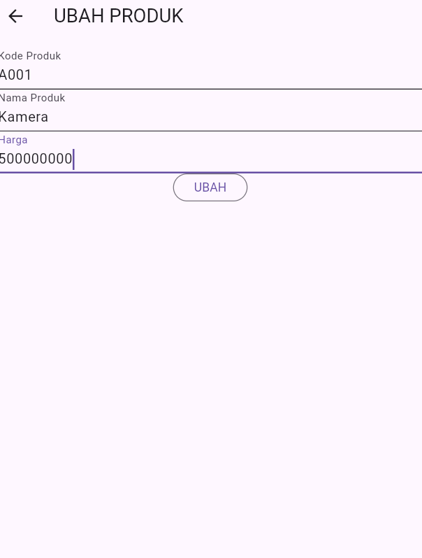
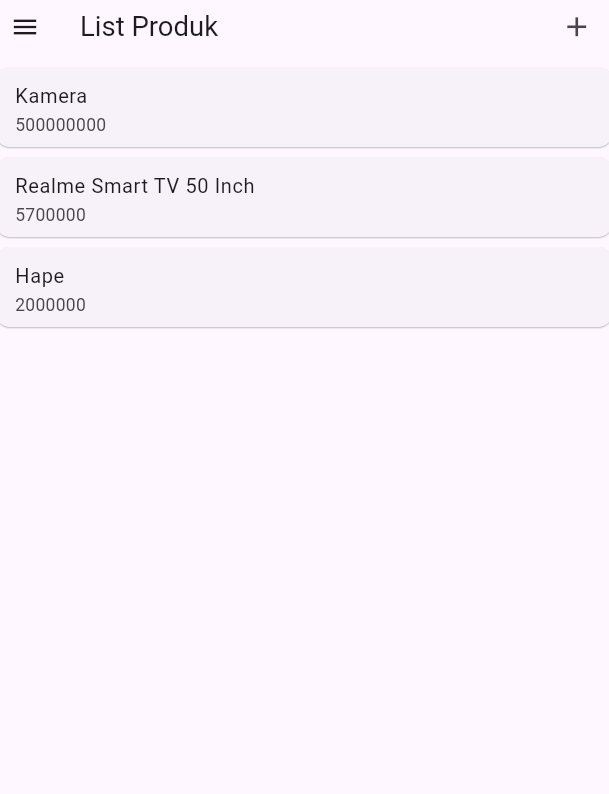
Proses ubah produk dimulai saat pengguna membuka halaman detail produk (ProdukDetail) dan memilih tombol "Edit". Setelah itu, pengguna akan diarahkan ke halaman ProdukForm yang telah diisi otomatis dengan data produk yang ingin diubah. Pengguna bisa melakukan modifikasi pada data, seperti mengubah kode produk, nama produk, atau harga produk. Ketika pengguna menekan tombol "Ubah", aplikasi akan mengambil data yang baru saja dimasukkan dan memperbarui objek Produk yang ada. Selanjutnya, fungsi updateProduk di dalam ProdukBloc akan dipanggil untuk mengirim permintaan PUT ke API, dengan mengirimkan data produk yang telah diperbarui. Jika permintaan berhasil, pengguna akan diarahkan kembali ke halaman ProdukPage yang memperlihatkan perubahan terbaru pada produk.

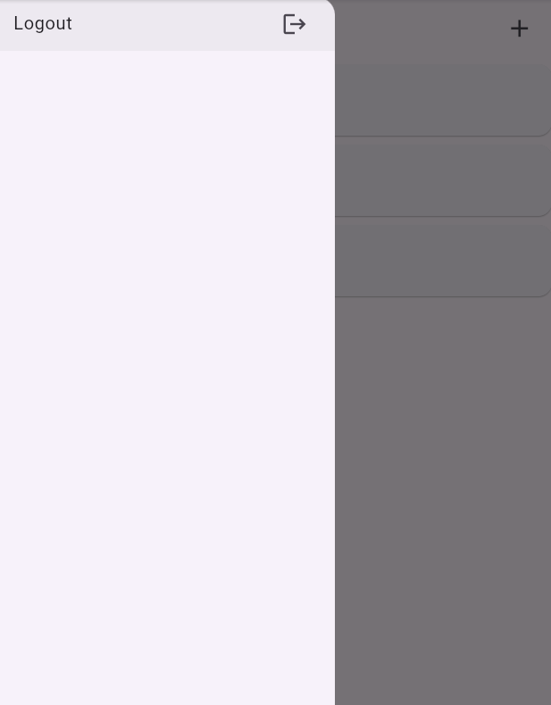
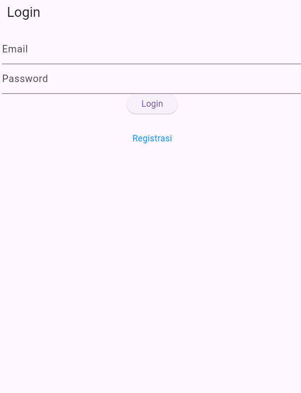
Proses logout dalam aplikasi ini memungkinkan pengguna untuk mengeluarkan diri dari akun mereka dengan aman. Saat pengguna menekan tombol logout, aplikasi memanggil metode logout() dari LogoutBloc, yang bertanggung jawab untuk menghapus informasi pengguna yang tersimpan, seperti token otentikasi. Setelah proses logout selesai, pengguna diarahkan kembali ke halaman login, sehingga mereka dapat masuk lagi jika diinginkan. 
